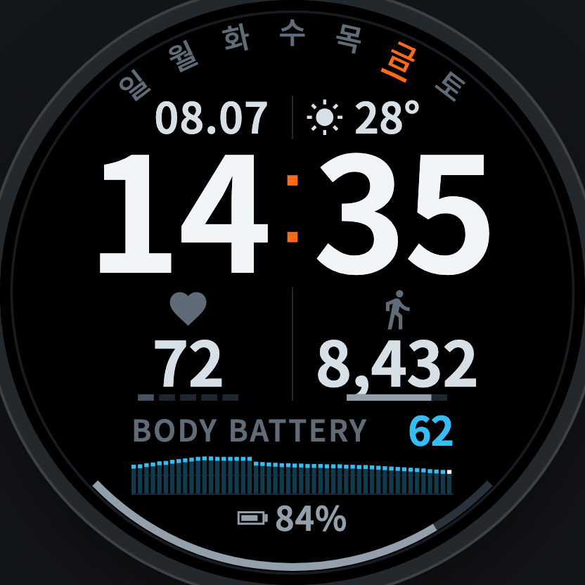
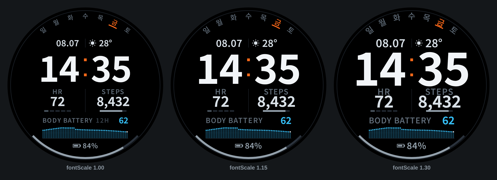

# RECON — Garmin Connect IQ watch face

A dark, instrument-style face for round Garmin displays. Built for legibility
first: one dominant readout (the time), everything else in a quiet, evenly
weighted support tier.



Target: **Forerunner 265** (416x416) and **265S** (360x360). The layout is
resolution-independent, so other round devices only need their id added to
`manifest.xml`.

## What it shows

| Data                | Where                                                            |
| ------------------- | ---------------------------------------------------------------- |
| Weekday             | Fan on the top bezel, `일 월 화 수 목 금 토`, today in accent + arc underline |
| Date                | Left of the strip under the weekday arc, `MM.DD`                  |
| Time                | Centre, 24-hour, `HH:MM`, always two digits                       |
| Weather + outdoor temp | Right of the strip: drawn condition glyph + current temperature |
| Heart rate          | Left stat cell, with a five-segment HR zone ladder underneath      |
| Steps               | Right stat cell, with a goal progress bar underneath               |
| Body battery        | Band above the bottom bezel: current value + 12-hour trend graph   |
| Device battery      | Bottom bezel gauge + numeric readout                               |

## Design decisions

**Brightness is the hierarchy.** Only the time is pure white (`#F2F5F8`).
Stat values sit one step down, labels two steps down, gauge tracks near-black.
Nothing needs a box or a background to separate it — the tonal steps do that.

**Colour is a channel, not decoration.** Each hue means exactly one thing:

- accent orange — today's weekday, the colon, and a met step goal
- steel — gauges and the device battery
- cyan — body battery, nowhere else
- the zone ramp — heart rate, nowhere else

**HR zone is read from the ladder, not from a number.** Five segments; the
count lit gives the zone and they all take that zone's colour. An earlier
version lit each segment in its own colour and the result was a rainbow that
read as ornament rather than data. Below zone 1 a single segment glows in the
resting tint so a resting heart rate never looks like a dead sensor.

**The body battery graph caps each column.** Body battery spends most of the
day between 40 and 100, so a plain 0–100 bar chart collapses into a solid slab.
Each column is filled dim and capped bright, which keeps the absolute level
legible *and* draws the shape of the curve. The most recent column is capped in
white as a "now" marker.

**The weekday row is a fan, not an arch.** Each glyph is rotated to stand on
its own radius, and the highlight under today is an arc segment rather than a
straight bar, so the whole row belongs to the bezel instead of sitting on top of
it. Garmin's system fonts have no bold variant, so today is marked by the accent
colour and that arc alone — never by weight or size, which the preview must not
promise either.

**The bezel carries the two cyclical values.** Weekday on the top arc, battery
gauge on the bottom arc. Both are things you glance at rather than read, and
putting them on the rim keeps the centre clear.

**Round-screen safety.** Every element is placed against the circle, not a
bounding box. Wide values (a six-digit step count) step down through a font
ladder rather than spilling into the neighbouring cell, and the body battery
window tag (`12H`) is dropped when a three-digit body battery needs the room.

**Always-on display** is the same face. AMOLED burn-in protection allows at
most 10% of pixels lit and no pixel lit for three minutes straight, so in
low-power mode every other row is blanked and the row parity flips with the
minute: the face reads at half brightness and no pixel stays on for longer
than a minute. The Forerunner 265 simulator reports 3.2% luminance usage.

## Layout and preview

`preview/face.js` is the visual source of truth. Every coordinate is authored
against a 454×454 round display and scaled by `size / 454` — which is exactly
what `source/Layout.mc` does on device. **When a number changes in one, it must
change in the other.**

```bash
cd preview
npm install          # also copies the Noto Sans KR subsets into ./fonts
npm run render       # writes ./renders/*.png at 416 and 454
npm run stress       # font-size stress sheet, see below
node render.mjs 360  # any display size
npm run serve        # interactive: scenario, size and weekday-locale switches
node icon.mjs        # regenerates ../resources/drawables/launcher_icon.png
```

`preview/scenarios.js` holds the cases worth checking: a resting weekday
afternoon, a zone-4 workout, an early morning at 100 body battery, a worst case
(six-digit steps, sub-zero temperature, 8% battery, midnight), a sensors-
unavailable state, and always-on display.

The preview approximates Garmin's built-in fonts with Noto Sans KR. Two
deliberate adjustments keep it honest rather than flattering:

- Nothing is drawn smaller than ~18px, because `FONT_XTINY` is the smallest
  font the device offers and it lands around there on a 454px display.
- Time digits are laid out in fixed-width cells, because Garmin's
  `FONT_NUMBER_*` faces are tabular and web fonts are not. Without this the
  preview would show a clock that drifts sideways as the minutes change.

Letter spacing on the small-caps labels has no equivalent in Monkey C, so
`Gfx.trackedText` lays those strings out one glyph at a time on device.

**Font stress.** The device picks its own system fonts and they do *not* scale
linearly with the design units, which is the largest thing the preview cannot
verify. `npm run stress` re-renders the face with every system-font-bound size
multiplied by 1.0, 1.15 and 1.3. The layout survives all three with no
collisions: at 1.15 and above the body battery window tag (`12H`) drops itself,
which is the designed release valve.



## Building

Requires the [Connect IQ SDK](https://developer.garmin.com/connect-iq/sdk/)
(`minApiLevel` 3.2.0) and a Java runtime. Install the **fr265** device package
through the SDK Manager first — `monkeyc -d` needs it.

```bash
# one-off: generate a developer key and keep it. The Connect IQ Store ties an
# app id to the key that first signed it, so losing it means a new listing.
openssl genrsa -out developer_key.pem 4096
openssl pkcs8 -topk8 -inform PEM -outform DER -in developer_key.pem \
  -out developer_key.der -nocrypt

mkdir -p bin
monkeyc -f monkey.jungle -o bin/recon.prg -y developer_key.der -d fr265 -r
```

Check it in the simulator before it ever reaches the watch:

```bash
connectiq                       # start the simulator
monkeydo bin/recon.prg fr265
```

## Installing on your own watch

No store listing needed — a `.prg` copied over USB is the whole mechanism.

1. Build for your exact device (above). A `.prg` is device-specific; one built
   for another model is ignored by the watch.
2. Connect the watch by USB. Windows shows it in Explorer; macOS cannot read
   MTP in Finder, so use [OpenMTP](https://openmtp.ganeshrvel.com/) or Android
   File Transfer.
3. Copy the file to `GARMIN/APPS/recon.prg`.
4. Eject, unplug, then pick **RECON** from the watch face list.

If it does not appear: the build targeted a different device id, Connect IQ
storage is full, or the face threw on first draw — the watch writes a log to
`GARMIN/APPS/LOGS/`.

## Source layout

| File                   | Role                                                        |
| ---------------------- | ----------------------------------------------------------- |
| `source/Layout.mc`     | All geometry, in 454-unit design space, scaled at runtime    |
| `source/Theme.mc`      | Palette, HR zone ramp, battery thresholds                    |
| `source/Gfx.mc`        | Primitives: screen-degree arcs, tracked text, weather glyphs |
| `source/Metrics.mc`    | Sensor reads, each degrading to `null` when unavailable      |
| `source/ReconView.mc`  | Composition and drawing                                      |
| `resources/`           | Korean weekday strings (default), launcher icon              |
| `resources-eng/`       | Latin weekday initials for English firmware                  |

Weather condition glyphs are drawn from primitives rather than shipped as
bitmaps, so the face carries no image assets and scales to every display size.

## First-build checklist

Since no build has run, these are the assumptions most likely to be wrong.
Check them in this order:

1. `iq:products` in `manifest.xml` is trimmed to `fr265` and `fr265s`. Building
   for anything else means adding its id there first, and an id your SDK
   Manager does not have installed fails the build immediately.
2. The `Toybox.Weather.CONDITION_*` names in `Metrics.glyphFor`. The enum is
   large and a single wrong name is a compile error; delete any the compiler
   rejects, the `default` branch already covers them.
3. `Gregorian.info(...).day_of_week` is assumed to be 1 = Sunday, which
   `Metrics.refresh` converts to a 0-based index. If today's weekday highlight
   lands on the wrong glyph, this is why.
4. `SensorHistory.Sample.data` is assumed to hold the body battery value, and
   `ORDER_NEWEST_FIRST` to put "now" at index 0. If the trend graph runs
   backwards, flip the downsample in `Metrics.readBodyBattery`.
5. `Gfx.arcScreen` converts screen degrees to Garmin's counter-clockwise
   convention. Confirm the battery gauge fills from the lower left toward the
   lower right; if it sweeps the wrong way the conversion is inverted.
6. `Dc.drawAngledText` is what rotates the weekday glyphs, and its angle is
   assumed to be counter-clockwise like `drawArc` — `Gfx.angledText` negates
   accordingly. If the fan leans the wrong way, drop the negation. Devices
   without the method fall back to upright glyphs automatically.
7. Font sizes. `Layout` positions everything by anchor and relies on
   `TEXT_JUSTIFY_VCENTER`, so wrong-sized system fonts will not break the
   layout, but the preview's proportions are an approximation — compare the
   simulator against `preview/renders/` and adjust `ReconView`'s font choices.

## Known limitations

- **This has not been compiled.** The environment it was written in has
  outbound HTTPS filtered by an egress policy that denies `developer.garmin.com`,
  so the SDK and its device packages could not be fetched. The device list in
  `manifest.xml`, the `Toybox.Weather` condition constants and the Monkey C
  itself are reviewed but unverified by a build. Expect to trim `iq:products` to
  the devices your SDK actually has installed, and to fix whatever the compiler
  flags on the first run.
- `iq:products` covers only the Forerunner 265 family. Other round devices
  should work as-is but have not been looked at.
- Weekday initials default to Korean, with `S M T W T F S` in `resources-eng/`
  for English firmware, because Hangul glyph coverage in the system font
  depends on the device's language build. **The fallback is unverified**: an
  explicit `base.lang.eng.resourcePath` line failed to parse, so the jungle now
  relies on the resource compiler resolving qualified directories from
  `<iq:languages>` on its own. If the weekday glyphs come out blank on English
  firmware, move the Latin strings into `resources/strings/strings.xml`.
- The weather strip shows the *current* conditions from
  `Weather.getCurrentConditions()`, not a daily high/low.
- The body battery window is fixed at 12 hours and its history is rebuilt at
  most once every 5 minutes; walking the sensor iterator is the most expensive
  thing this face does.

## Third-party assets

The heart-rate and steps icons in `resources/drawables/` are
[Material Symbols](https://github.com/google/material-design-icons)
(`favorite`, `directions_walk`, filled), licensed Apache-2.0. They are
rasterised at their native 24px design grid with `Theme.TEXT_LOW` on
`Theme.BG` baked in, because Connect IQ cannot tint a bitmap at draw time.

That makes them the one part of the face that does not scale with the design
grid: a device other than the Forerunner 265 family would get a 24px icon
regardless of its screen. Add a device-qualified `resourcePath` in
`monkey.jungle` and a second rasterisation if that ever matters.
